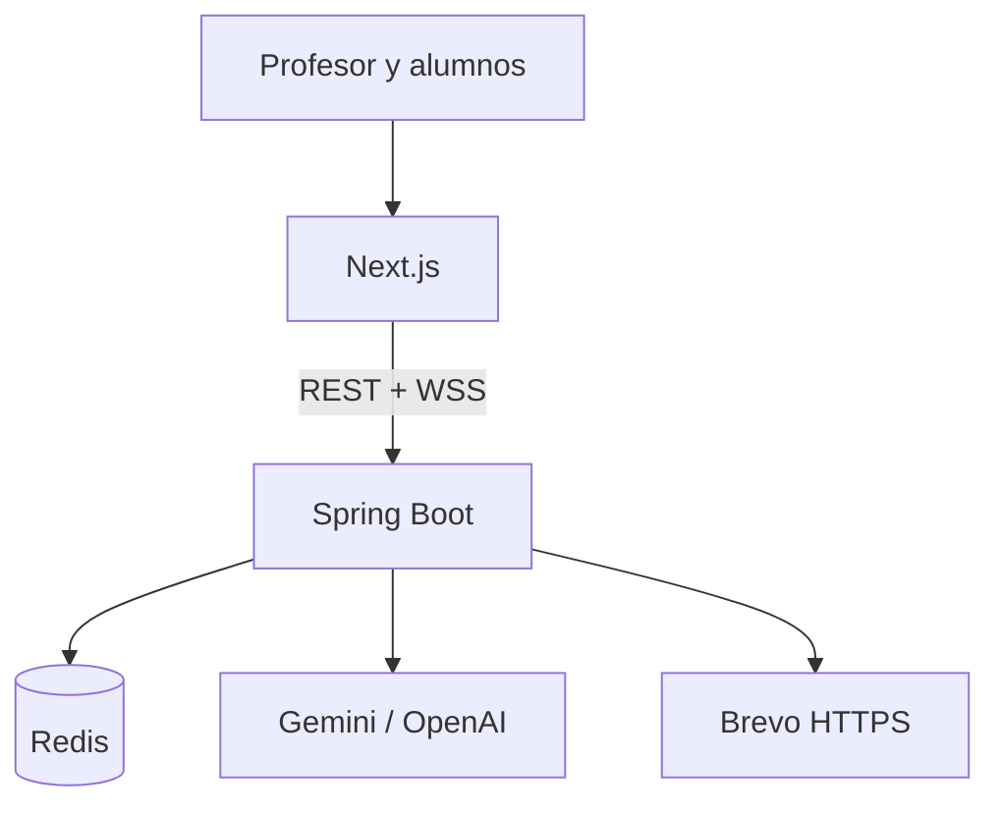

# Arquitectura de CrossEd

## Componentes

El frontend contiene las vistas de creación, sala, juego y resultados. El backend es autoritativo para permisos, tiempo, respuestas, puntajes y ranking. Redis conserva la partida serializada y permite sobrevivir reinicios del contenedor. STOMP solo distribuye eventos; las mutaciones se realizan por REST.

## Decisiones principales

- Tokens opacos para profesor y alumnos, almacenados mediante hash.
- DTO de alumno sin soluciones, correos, hashes ni tiempos internos.
- Código de acceso independiente del identificador interno.
- Normalización de respuestas compatible con tildes y `Ñ`.
- Finalización idempotente y cola de estados de correo por destinatario.
- Brevo por HTTPS para evitar restricciones SMTP del hosting gratuito.
- Una única instancia del backend en el MVP, compatible con el broker STOMP en memoria.

## Persistencia

Cada modificación relevante guarda la partida en Redis. La clave visible permite resolver el código compartido. El despliegue recomendado utiliza TLS y credenciales de Upstash.

## Flujo de correo

Al finalizar una partida se crean envíos pendientes para el profesor y cada alumno. Una tarea programada los procesa. Si existe `BREVO_API_KEY`, usa Brevo; de lo contrario intenta SMTP. Un fallo de correo no revierte ni bloquea el cierre de la actividad y el profesor puede reintentar los envíos.

